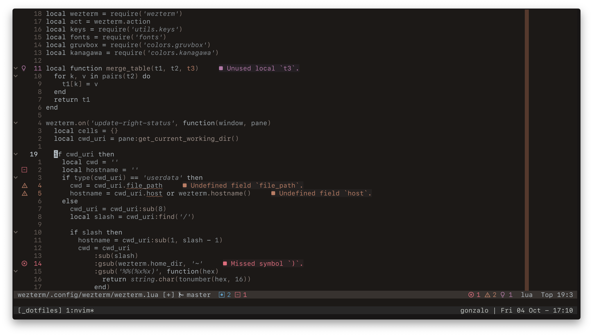

## Gonzalo Stoll's dotfiles




These are my dotfiles. They are not meant to be used as is, but feel free to
take whatever you want from them.

## Features

Some of the programs and systems used in these dotfiles are:

- Editor - [Neovim](https://neovim.io/)
- Shell - [Zsh](https://www.zsh.org/)
- Terminal - [WezTerm](https://wezfurlong.org/wezterm/index.html)
- Multiplexer - [tmux](https://github.com/tmux/tmux/wiki)

## Installation

Execute the following command:

```bash
git clone --recurse-submodules https://github.com/gonstoll/dotfiles.git ~/.dotfiles && cd ~/.dotfiles
chmod +x ./install.sh && ./install.sh
stow *
```

First, this script will let you choose whether to install or not a set of
scripts for some base configuration:

- [Homebrew](https://brew.sh/) and a set of packages ([find them
  here](https://github.com/gonstoll/dotfiles/blob/master/Brewfile))
- MacOS settings (things like key-repeat rate, menu bar icons. It even features mczachurski's
  [wallpapper](https://github.com/mczachurski/wallpapper) to let you easily setup dynamic wallpapers)
- Runtime scripts (like `npm` global packages)

Then, it will install the aforementioned features by symlinking them to their
corresponding locations using [GNU Stow](https://www.gnu.org/software/stow/).
